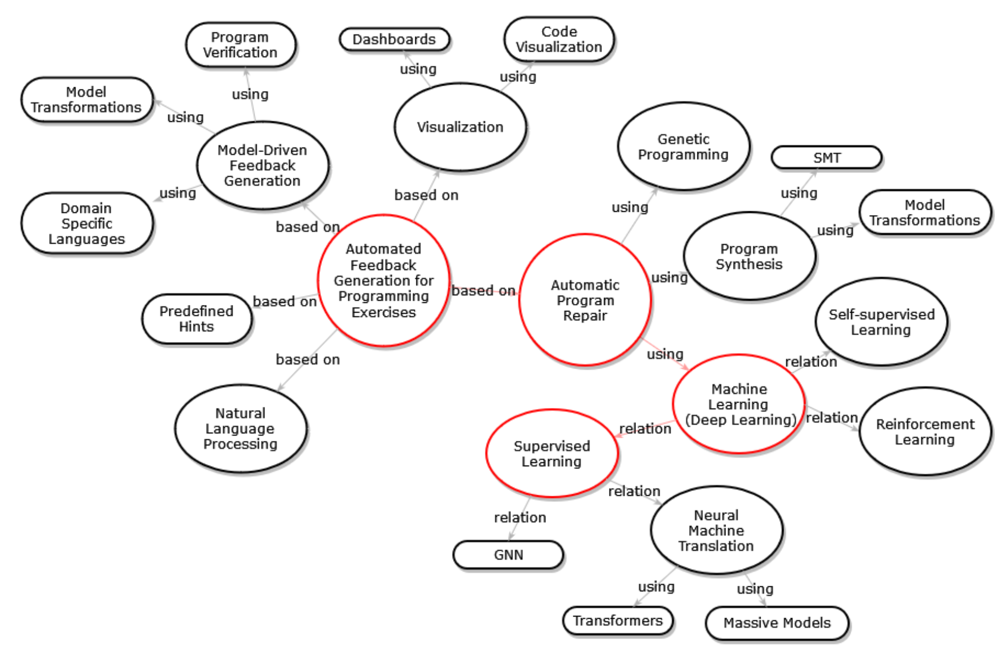
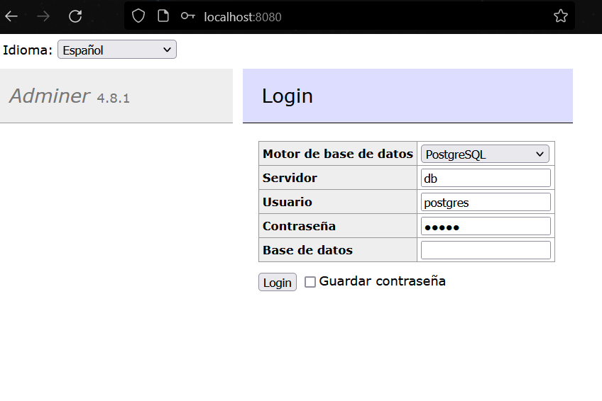
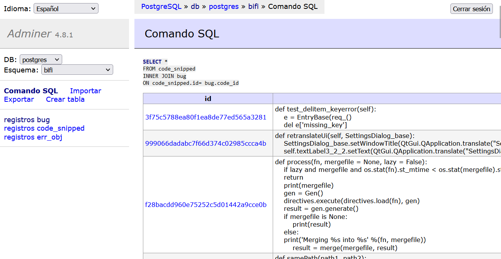
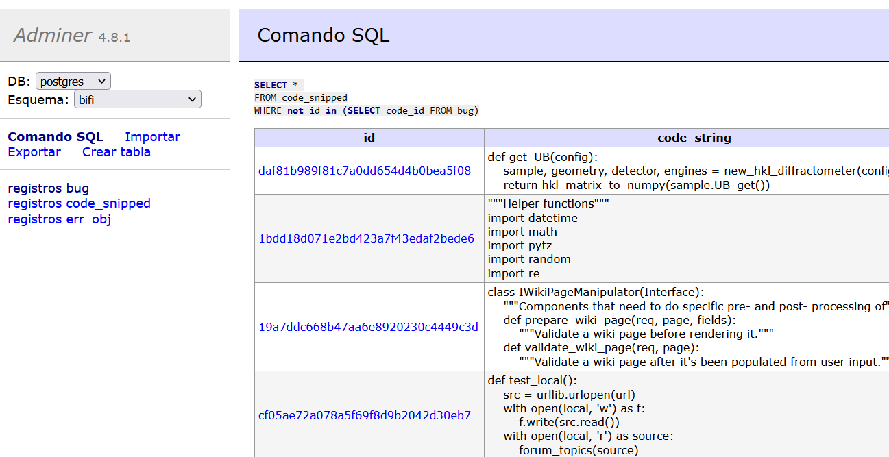
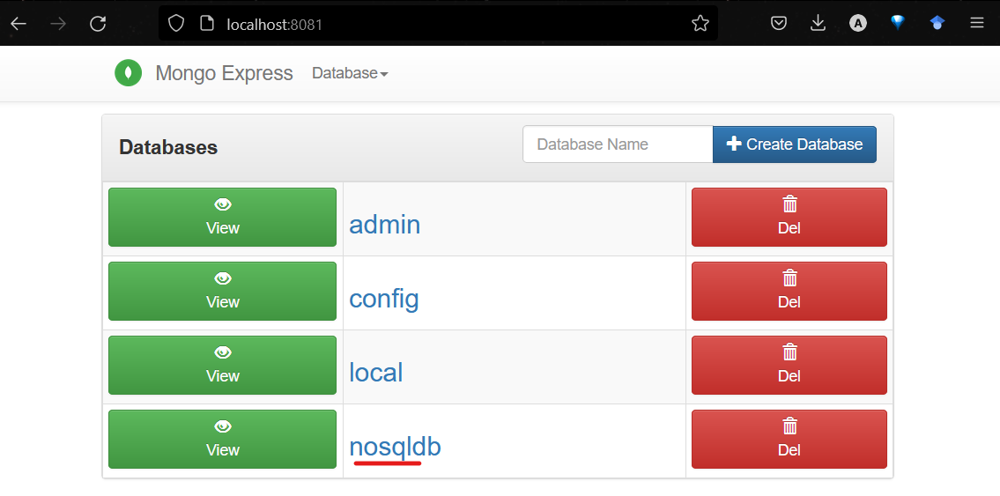
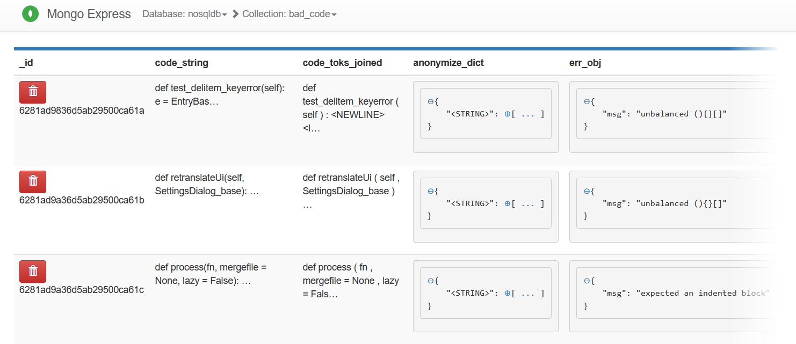
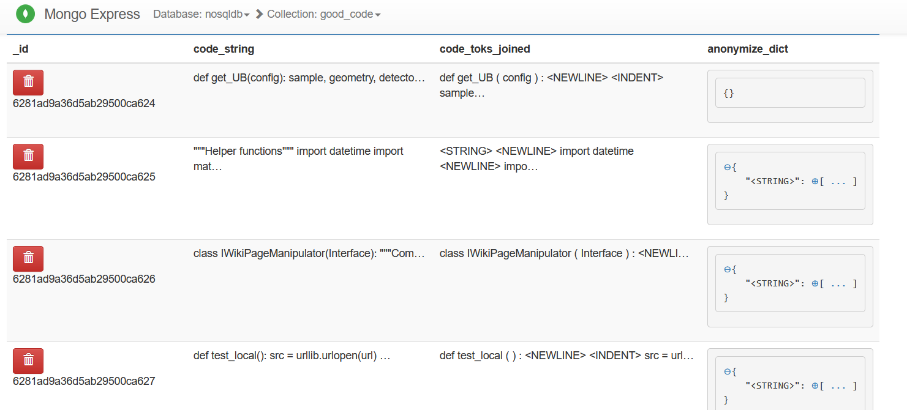

# EXERCISE – DATABASE DESIGN/IMPLEMENTATION.

## DESCRIPTION

The goal of this exercise is to reinforce concepts and processes about database design and implementation. In this exercise, for the data used in their particular term project, each project team will need to perform i) some relational database modeling and implementation, and ii) some NoSQL database modeling and implementation. This homework must be done by the particular teams assigned to develop the term projects.
Deliverables:

I. A document with a detailed description of the modeling and implementation of the two database approaches which should include at least:

- A description of the domain and the problem tackled in the term project.
- A detailed description of the data to manage in the problem.
- A relational database model and implementation for your data.
- A NoSQL database model and implementation for your data.
- A comparison of the relational and NoSQL databases implemented needs to be includes, stating which of the two models is more suitable to handle your data.
- In both cases, the rationale for the selection of the software tools used must be included.

II. The software implementations need to be added/uploaded in the corresponding repository of your project.

The public repository for this project is:

https://github.com/alejandro56664-2/final-project-intro-ds-2022-1

## 1. Introduction

One of the main considerations to take into account when creating a project that uses data is its computational representation and future storage. Databases currently focus on managing massive amounts of data in a quick, consistent, stable and repeatable manner.

The relational model is based on mathematical theory (set theory, relational theory) whereas the non-relational databases may or may not have a single
groundwork. Relational databases are beneficial when it comes to robustness, flexibility, reliability and scalability requirements but in order to cater to the needs of modern applications where the data is huge and generally unstructured; Non-relational databases show true signs of usability aiming at being "developer-friendly".

SQL databases are most often implemented in a scale-up architecture, which is based on using ever larger computers with more CPUs and more memory to improve performance. NoSQL databases were created in Internet and cloud computing eras that made it possible to more easily implement a scale-out architecture, where scalability is achieved by spreading the storage of data and the work to process the data over a large cluster of computers. To increase capacity, more computers are added to the cluster.

Still, many Non-relational databases are disk-based which implement buffer pool and multithreading hence require buffer management and locking features which add on to performance overhead. Also, many provide BASE properties and sacrifice conventional ACID properties as a step to increase performance. That's why the degree of reliability provided by non-relational databases is lower than what is provided by the relational databases. Developers have to rope in programming to apply ACID restraints which could have been provided easily in relational databases.

We will compare two implementations of our database model (one Relational in PostgreSQL and one Non-relational in MongoDB) and pick the best given the implementation requirements based on our domain and the intrinsic characteristics of our data, its ease of access, performance and scalability.

## 2. Domain description

Improving the speed at which human beings acquire new knowledge is a fundamental challenge in society development. Various techniques such as Formative Learning [[1]](http://arxiv.org/abs/2106.16199) have generated many benefits including Learning Progressions, Learning Goals and Criteria for Success, Descriptive Feedback, Self and Peer Assessment and Collaboration between individuals.

There is a variety of techniques that can be used to deliver feedback automatically to the students. The different approaches range from the most basic such as delivering predefined tracks, which are the basis of what can be group as knowledge-driven feedback, to more sophisticated models based on natural language processing using machine learning:



A common approach to perform learning-based repair tasks is to use neural translation techniques, in which pairs are needed (Buggy Code, Correct Code). To build that kind of data set, there are two options: first, the researchers can mine repositories and manually identify which commit introduced a bug and which commit resolved it, or create training data consisting of (bad, good) pairs by corrupting good examples using heuristics. The second approach may seem attractive, especially to build large synthetic datasets from smaller sets, however, fixers trained on this synthetically-generated data do not extrapolate well to the real distribution of bad inputs. To solve this problem BIFI[[2]](https://dl.acm.org/doi/10.1145/3231711) propose: first, use the critic to check a fixer’s output on real bad inputs and add good (fixed) outputs to the training data and train a breaker to generate realistic bad code from good code.

This proposal seems interesting to create synthetic datasets that allow evaluating repair models from smaller datasets or datasets that were not originally intended for repair tasks. For this reason we have decided to use this work as a basis for this project.

Our work consists of replicating the BIFI work and using it with the MBPP dataset to evaluate its performance (accuracy, precision, etc.), repairing assignments of basic programming problems. Our idea is to produce an experimental set where BIFI is the baseline to propose repair models for automatic feedback generation that try to improve the registered metrics.

## 3. Data description

For this PoC (Proof of Concept) only a small portion of the data (~10 samples) will be used to perform the Transform and Load tests on the data from the original file structure and formats. This data can be found in `./data/`.

Document example in the 'Bad' code dataset:

```json
{
  "3f75c5788ea80f1ea8de77ed565a3281": {
    "code_string": "def test_delitem_keyerror(self):\n    e = EntryBase(req_()\n    del e['missing_key']\n",
    "code_toks_joined": "def test_delitem_keyerror ( self ) : <NEWLINE> <INDENT> e = EntryBase ( req_ ( ) <NEWLINE> del e [ <STRING> ] <NEWLINE> <DEDENT>",
    "anonymize_dict": {
      "<STRING>": ["'missing_key'"]
    },
    "err_obj": {
      "msg": "unbalanced (){}[]"
    }
  }
}
```

Document example in the 'Good' code dataset:

```json
{
  "1bdd18d071e2bd423a7f43edaf2bede6": {
    "code_string": "\"\"\"Helper functions\"\"\"\nimport datetime\nimport math\nimport pytz\nimport random\nimport re\n",
    "code_toks_joined": "<STRING> <NEWLINE> import datetime <NEWLINE> import math <NEWLINE> import pytz <NEWLINE> import random <NEWLINE> import re <NEWLINE>",
    "anonymize_dict": {
      "<STRING>": ["\"\"\"Helper functions\"\"\""]
    }
  }
}
```

## 4. First Approach: Relational Database Model

Relational databases allow you to define the dependencies between your entities through relationships. They have demonstrated their robustness over time and encourage several normalization standards for their optimal use.  They allow by default a standardization of data types in each of their tables to ensure consistency and prevent failures, while being designed with a scale-up mindset and often have broad enterprise support.

### 4.1 Data Modeling

**Figure with the proposed data model**


Since our input data can be divided into "Good" and "Bad" code snippets; we can think of them as the two initial tables **code_snipped** and **error**. Each "Good" code snippet will be used together with several "Bad" code block through a "Bug", to find solutions to it through training. The main benefit of this model is that it avoids data redundancy by employing a finite number if bugs which will be referenced in both **code_snipped** and **error** tables.

### 4.2 Rational for SQL Engine selection

**Selection criteria**

The selection criteria proposed to help choose the right database engine to carry out this exercise are described below.

- C1 Preference over open source database engines.
  - We specify the license that covers the engine.
- C2 Database engines in which the team has previous knowledge or experience, in order to reduce risks when implementing the exercise.
  - The group or individual that built or is maintaining the software.
- C3 Database engines that can be executed locally using a container tool.
  - If there's a docker supported container on https://hub.docker.com.
- C4 Preference will be given to database engines fully adopted in the industry.
  - Popularity ranking taken from https://db-engines.com/en/ranking for the month of May of 2022. It is based on:
    - Number of mentions on websites (using Google and Bing).
    - General interest (Google Trends).
    - Frequency of technical discussions about the system (Stack Overflow and DBA Stack Exchange).
    - Number of job offers (Indeed and Simply Hired).
    - Profiles in professional networks (LinkedIn).
    - Relevance in social networks (number of Tweets).

**Comparative Table**

|                              | C1          | C2                                  | C3                                   | C4      |
|------------------------------|-------------|-------------------------------------|--------------------------------------|---------|
| Oracle                       | Commercial  | Oracle                              | https://hub.docker.com/_/oraclelinux | 1262.82 |
| MySQL                        | Open Source | Oracle                              | https://hub.docker.com/_/mysql       | 1202.10 |
| Microsoft SQL Server         | Commercial  | Microsoft                           | No                                   | 941.20  |
| PostgreSQL                   | Open Source | PostgreSQL Global Development Group | https://hub.docker.com/_/postgres    | 615.29  |
| IBM Db2                      | Commercial  | IBM                                 | https://hub.docker.com/r/ibmcom/db2  | 160.32  |
| Microsoft Access             | Commercial  | Microsoft                           | No                                   | 143.44  |
| SQLite                       | Open Source | Dwayne Richard Hipp                 | No                                   | 134.73  |
| MariaDB                      | Open Source | MariaDB Corporation                 | https://hub.docker.com/_/mariadb     | 111.13  |
| Snowflake                    | Commercial  | Snowflake Computing Inc.            | No                                   | 93.51   |
| Microsoft Azure SQL Database | Commercial  | Microsoft                           | No                                   | 85.33   |

Understanding that we were looking for an Open Source database, which would allow us to use containers for its scalability and with a significant adoption in the industry, we reduced the options to MySQL and PostgreSQL. Both had experienced companies on their side. Still, our team had more experience using PostgreSQL so we opted for it.

## 5. Second Approach: NoSQL Database Model

Non-relational databases are much more flexible than relational ones because they allow us to work with many types of data in the same table. They are primarily looking for horizontal scaling and a better developer experience. Our input data is in JSON format so not having to define schemas for each type is a great advantage.

### 5.1 Data Modeling

Understanding the same conception of two tables (one with "Good" code and one with "Bad" code) we can create them as **good_code** and **bad_code**. However, since this database is non-relational, it is not necessary to define such a **bug** relation as in the previous example, and we can store such information in the **bad_code** table in the **err_obj** field.

**Figure with the proposed data model**


The bug data will be repeated several times, but its writing and access will be very simple. In addition, the dataset used is made up of 3 million code snippets, so despite being large, it does not necessarily represent a considerable storage cost.

### 5.2 Rational for NoSQL Engine selection

For simplicity, the same criteria used to select software tools (relational database engines) are used here.

**Comparative Table**

|                 | C1          | C2                                                        | C3                                             | C4     |
|-----------------|-------------|-----------------------------------------------------------|------------------------------------------------|--------|
| MongoDB         | Open Source | MongoDB, Inc                                              | https://hub.docker.com/_/mongo                 | 478.24 |
| Redis           | Open Source | Redis project core team, inspired by Salvatore Sanfilippo | https://hub.docker.com/_/redis                 | 179.00 |
| Elasticsearch   | Open Source | Elastic                                                   | https://hub.docker.com/_/elasticsearch         | 157.69 |
| Cassandra       | Open Source | Apache Software Foundation                                | https://hub.docker.com/_/cassandra             | 118.01 |
| Splunk          | Commercial  | Splunk Inc.                                               | No                                             | 96.35  |
| Amazon DynamoDB | Commercial  | Amazon                                                    | https://hub.docker.com/r/amazon/dynamodb-local | 84.46  |
| Neo4j           | Open Source | Neo4j, Inc.                                               | https://hub.docker.com/_/neo4j                 | 60.14  |
| Solr            | Open Source | Apache Software Foundation                                | https://hub.docker.com/_/solr                  | 57.26  |
| Databricks      | Open Source | Databricks                                                | No                                             | 47.85  |
| HBase           | Open Source | Apache Software Foundation                                | No                                             | 43.19  |

It is interesting to see how the vast majority of non-relational databases are Open Source. However, its acceptance at the industrial level is usually less than that of its relational counterpart.

Redis is often used for tasks regarding Session Cache, Full Page Cache (FPC), Queues and other concerns using RAM. Elasticsearch is mainly used as a search engine and is highly optimized for text search. Still, we have each of our documents indexed so we won't its features to the fullest. Mainly due to community usage and robustness we opted for MongoDB.

## 6. Implementation

This section describes the steps to replicate the data models deployed to the selected database engines.

Important:
In this proof of concept, containerized database engines using docker compose do not have persistence configured.


### 6.1 Software requeriments

To replicate this work we recommend having the following software installed on your computer:

- [Git](https://git-scm.com/)
- [Docker](https://www.docker.com/products/docker-desktop/)

### 6.2 Steps to execute

Clone the repository:

```sh
git clone git@github.com:alejandro56664-2/final-project-intro-ds-2022-1.git
```

Move to the folder:

```sh
cd final-project-intro-ds-2022-1/2_database_design_impl
```

Create the Transform & Load Container:

```sh
cd src
docker build -t tltask .
```

Start the containers using docker compose:

```sh
cd ..
docker compose up
```

Wait until de docker compose pull the images and load the containers.

Now you can enter the path `localhost:8080` in your browser to enter Adminer, which will allow you to query the db database that contains the relational model of the data.



> Remember to select 'PostgreSQL' and the server 'db'.
> The credentials can be found in the `docker-compose.yml` file.

> Remember to select 'bifi' schema.

You can query bad code using the next SQL code:

```sql
SELECT *
FROM code_snipped
WHERE not id in (SELECT code_id FROM bug)
```

Result:



The query for good code:

```sql
SELECT *
FROM code_snipped
INNER JOIN bug
ON code_snipped.id= bug.code_id
```

Result:



On the other hand, to query the NoSQL model, you must enter the path `localhost:8081` in your browser to access Mongo Express, which will allow you to query the data.



You can see the items in the bad code collection:



The items for good are shown in the image below:



## 7. Conclusions

In many instances where storage and performance limitations may be an issue, it's clear how development time tends to become the largest product cost. But mainly, enterprises advocate for the support and robustness of a fault proof system that can prevent human mistakes.

During the development of this exercise it was evident how by not requiring to use an extra relationship in each of our Create, Read, Update and Delete operations, our productivity increased significantly. For cases in which not many schemas and/or tables aren't used in the database, a Document Store like MongoDB makes the job much easier than a relational database like PosgreSQL. In case the mathematical model that we will implement during the project requires adding or removing fields from the collections, it will be achieved in a non-disruptive way since MongoDB allows us to store our documents in an unstructured way.

As for the future, both databases provide horizontal scaling by default. In terms of community acceptance, both are fairly popular (PostgreSQL with a score of 615.29 and MongoDB with 478.24).


## 8. References

- https://docs.docker.com/compose/
- https://hub.docker.com/_/postgres
- https://hub.docker.com/_/mongo
- https://wiki.postgresql.org/wiki/Psycopg
- https://www.mongodb.com/languages/python
- https://db-engines.com/en/ranking
- [1] U. Z. Ahmed, Z. Fan, J. Yi, O. I. Al-Bataineh, and A. Roychoudhury, “Verifix: Verified repair of programming assignments,” 6 2021. [Online]. Available: http://arxiv.org/abs/2106.16199
- [2] H. Keuning, J. Jeuring, and B. Heeren, “A systematic literature review of automated feedback generation for programming exercises,” ACM Transactions on Computing Education, vol. 19, pp. 1–43, 1 2019. [Online]. Available: https://dl.acm.org/doi/10.1145/3231711
