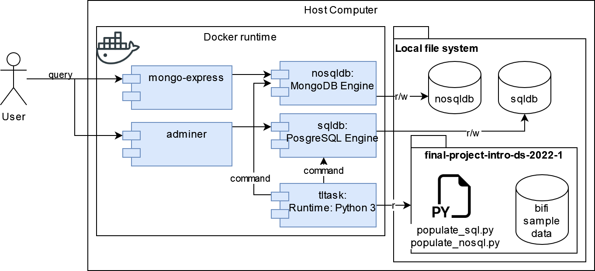

# EXERCISE – DATABASE DESIGN/IMPLEMENTATION.

## DESCRIPTION

The goal of this exercise is to reinforce concepts and processes about database design and implementation. In this exercise, for the data used in their particular term project, each project team will need to perform i) some relational database modeling and implementation, and ii) some NoSQL database modeling and implementation. This homework must be done by the particular teams assigned to develop the term projects.
Deliverables:

I.	A document with a detailed description of the modeling and implementation of the two database approaches which should include at least:
- A description of the domain and the problem tackled in the term project.
- A detailed description of the data to manage in the problem.
- A relational database model and implementation for your data. 
- A NoSQL database model and implementation for your data. 
- A comparison of the relational and NoSQL databases implemented needs to be includes, stating which of the two models is more suitable to handle your data.
- In both cases, the rationale for the selection of the software tools used must be included.

II.	The software implementations need to be added/uploaded in the corresponding repository of your project.

The public repository for this project is:

https://github.com/alejandro56664-2/final-project-intro-ds-2022-1

## 1. Introduction

TODO 

## 2. Domain description

TODO

## 3. Data description


For this PoC  (Proof of Concept) only a small portion of the data (~10 samples) will be used to perform the Transform and Load tests on the data from the original file structure and formats. This data can be found in ```./data/```

## 4. First Approach: Relational Database Model

TODO

### 4.1 Data Modeling

TODO

**Figure with the proposed data model** 


### 4.2 Rational for SQL Engine selection

TODO

**Selection criteria**

The selection criteria proposed to help choose the right database engine to carry out this exercise are described below.

- Preference over open source database engines.
- Database engines in which the team has previous knowledge or experience, in order to reduce risks when implementing the exercise.
- Database engines that can be executed locally using a container tool.
- Preference will be given to database engines fully adopted in the industry.

**Comparative Table**

## 5. Second Approach: NoSQL Database Model

TODO

### 5.1 Data Modeling

TODO

**Figure with the proposed data model**


TODO

### 5.2 Rational for SQL Engine selection

TODO

**Comparative Table**

TODO

## 6. Implementation 

This section describes the steps to replicate the data models deployed to the selected database engines.



### 6.1 Software requeriments

To replicate this work we recommend having the following software installed on your computer:

- [Git](https://git-scm.com/)
- [Docker](https://www.docker.com/products/docker-desktop/)

### 6.2 Steps to execute

Clone the repository:
```sh
git clone git@github.com:alejandro56664-2/final-project-intro-ds-2022-1.git
```
Move to the folder:

```sh
cd final-project-intro-ds-2022-1/2_database_design_impl
```
Create the Transform & Load Container:

```sh
cd src
docker build -t tltask .
```

Start the containers using docker compose:
```sh
cd ..
docker compose up
```
Wait until de docker compose pull the images and load the containers.

 
## 7. Conclusions

TODO

## 8. References

- https://docs.docker.com/compose/
- https://hub.docker.com/_/postgres
- https://wiki.postgresql.org/wiki/Psycopg
